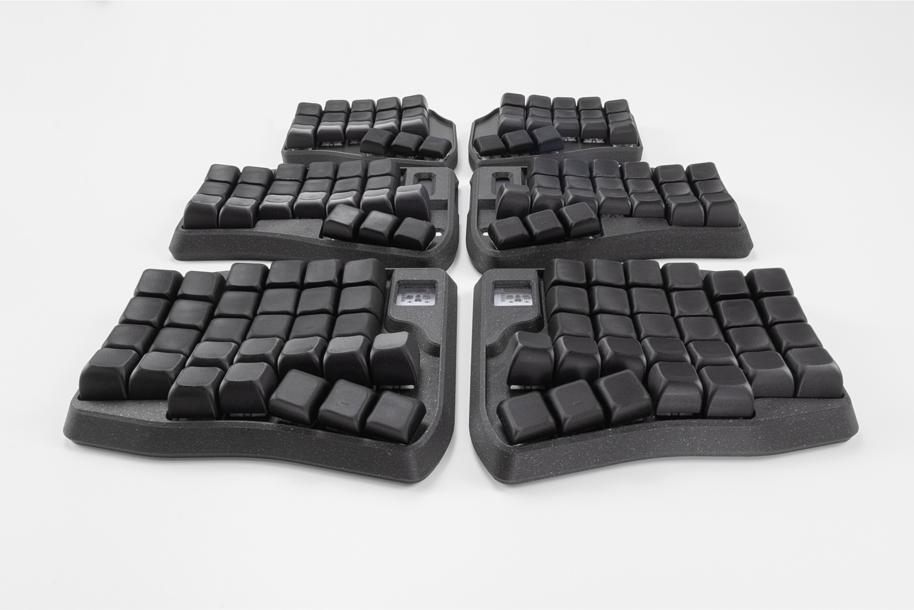
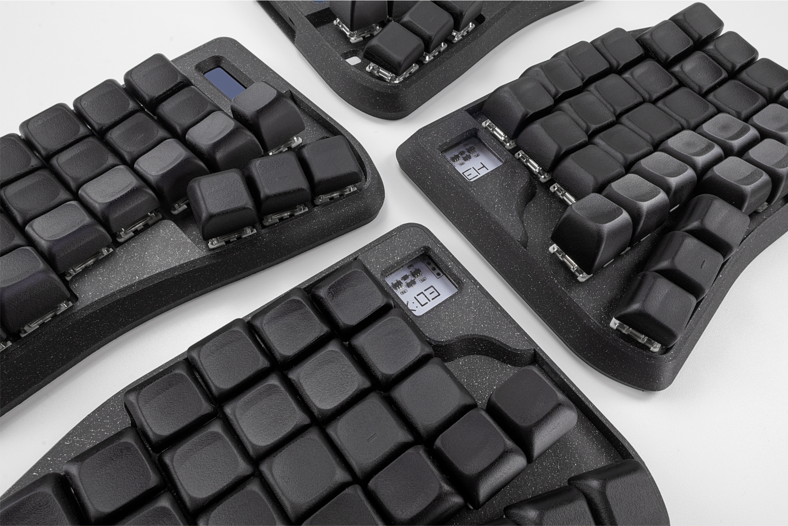
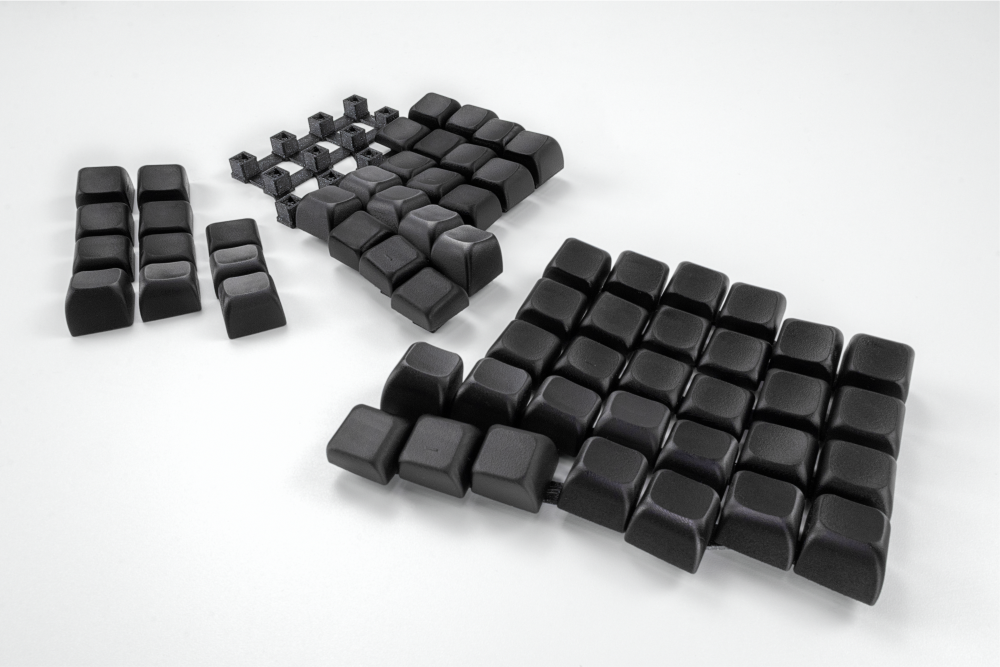
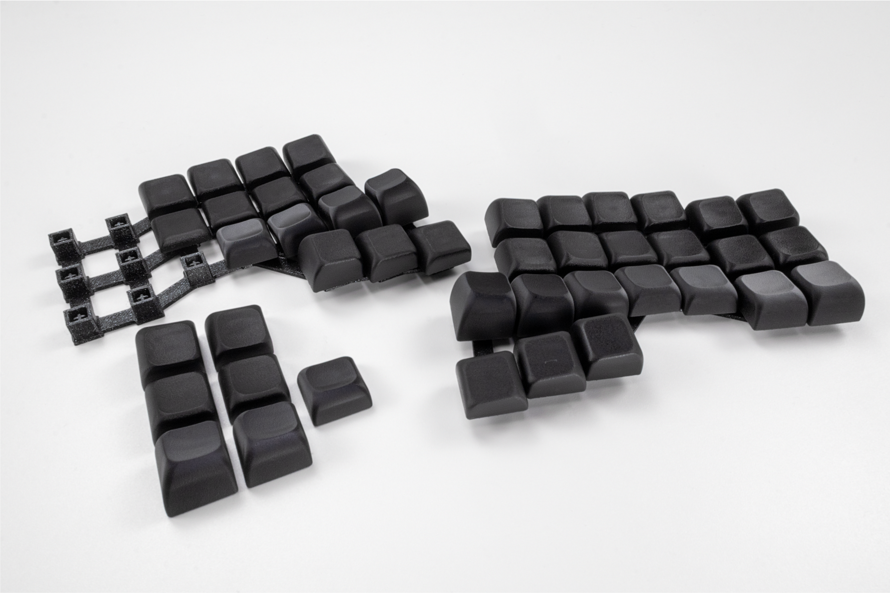

# Sculpt – Parametric Keycap Generator by Ergohaven


## Overview

Sculpt is a parametric ergonomic keycap generator for CadQuery and CQ-Editor, built for multi-axis, concave keycap design on ergonomic keyboards. It gives direct control over key height, sweep, pitch, yaw, local face tilt, and thumb cluster geometry, while keeping the workflow simple and editable from a single Python file.

The script generates not only the keycaps themselves, but also integrated printable support geometry designed to preserve surface quality and make the models easier to manufacture.

Sculpt can export both STL files for printing and STEP files for further CAD editing.

## Features

- Fully parametric sculpted keycap generation
- Per-key control of pitch, yaw, face tilt, and height
- Dedicated thumb cluster tuning
- Cherry MX-compatible stem geometry
- Integrated printable support geometry
- STL and STEP export
- Works in CQ-Editor, OCP CAD Viewer, and CLI mode

## Examples of finished keycaps

<p align="center">
  
  
</p>

<p align="center">
  
  
</p>

## Requirements

- [Python 3](https://www.python.org/downloads/)
- [CadQuery](https://cadquery.readthedocs.io/en/latest/installation.html)
- [jmwright-CQ-Editor](https://github.com/jdegenstein/jmwright-CQ-Editor/releases) or another CadQuery-compatible viewer
- [OCP modules used by CadQuery](https://cadquery.readthedocs.io/en/latest/installation.html)

## Quick Start

### CQ-Editor

1. Open `Sculpt_keycaps_v1.py` in CQ-Editor.
2. Edit the main parameters at the top of the file.
3. Set:
   - `MODE = "single" | "left" | "right" | "both"`
   - `QUALITY = "draft" | "production"`
   - `INCLUDE_FN_ROW = True | False`
4. Run the script.
5. Export the result as STL or STEP.

### CLI

```bash
python Sculpt_keycaps_v1.py --mode single --quality production --output test_keycap.step
python Sculpt_keycaps_v1.py --mode left --quality production --output left_hand.step
python Sculpt_keycaps_v1.py --mode both --quality draft --fn-row --output sculpt_full.step
```

You can also override the quality preset manually:

```bash
python Sculpt_keycaps_v1.py --mode left --slices 20 --output left_hand.step
```

## Main Parameter Groups

### Keycap parameters

- `KC_BASE_WIDTH`
- `KC_FACE_WIDTH`
- `KC_BASE_RADIUS`
- `KC_FACE_RADIUS`
- `KC_CAVITY_SCALE`
- `KC_SUPPORT_TOP_THIN`
- `KC_SUPPORT_ANGLE`
- `KC_SLICES`
- `KC_DIMPLE_INSET`
- `KC_DIMPLE_TRANSITION_FILLET`
- `KC_TOP_THICKNESS_MIN`

These parameters define the outer keycap shape, cavity scale, support geometry, dimple behavior, and minimum shell thickness.

### Stem parameters

- `STEM_BASE_HEIGHT`
- `STEM_BASE_SPACING`
- `STEM_KEY_WIDTH`
- `STEM_BASE_LIFT`
- `STEM_WING_BREADTH`
- `STEM_WING_THICKNESS`

These parameters control the Cherry MX stem geometry and fit.

### Layout parameters

- `LAYOUT_UNIT`
- `LAYOUT_DIMPLE_DEPTH`
- `DEFAULT_FACE_TILT`
- `KEYCAP_BOOT_HEIGHT`
- `STEM_BOOT_HEIGHT`
- `MAX_KEY_HEIGHT`
- `MIN_KEY_HEIGHT`
- `LAYOUT_COLUMNS`
- `LAYOUT_ROWS`

These parameters control key spacing, dimple depth, boot/support height, overall sculpt range, and matrix dimensions.

### Thumb cluster parameters

- `THUMB_HEIGHTS`
- `THUMB_SWEEP`
- `THUMB_FACE_TILT`

These parameters define the thumb cluster height, sweep angles, and local face tilt.

### Per-key tuning

- `KEY_ANGLES`
- `KEY_FACE_TILT`
- `KEY_HEIGHT`

These arrays control the sculpt of each individual key.

- `KEY_ANGLES` sets per-key pitch and yaw
- `KEY_FACE_TILT` adds local top-surface tilt
- `KEY_HEIGHT` defines explicit key height values

Together, they provide full control over the final shape of the layout.

## Output

Sculpt can generate:

- a single test keycap
- the left-hand layout
- the right-hand layout
- both halves together

Export formats:

- `.stl` for 3D printing
- `.step` for CAD editing and downstream modeling workflows

## Printing Notes

Sculpt includes integrated support geometry intended to make printing easier while preserving the visible surfaces of the keycaps. This support strategy was developed specifically for SLA printing.

The generated models are designed to be placed on the print bed at a print-friendly angle. Final fit may still require small tolerance adjustments depending on your printer, material, slicer profile, and stem calibration.

## Acknowledgments

This project was inspired in part by [key-sweep](https://github.com/sammy-hughes/key-sweep) by Sammy Hughes.

## License

See [LICENSE](./LICENSE).

